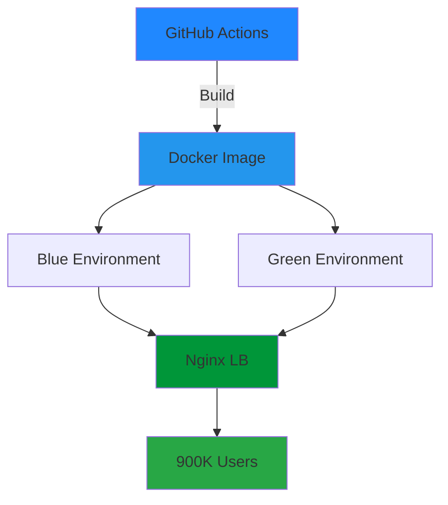

<div align="center">


# 💻 Backend Engineer

<p>
  
</p>

[](https://www.linkedin.com/in/sangwoo-lee-a107ab16b)
[](mailto:a26484638@gmail.com)
[](https://dev.to/sangwoo_rhie)


</div>

---

## 🚀 What I Do

<table>
<tr>
<td width="50%">

### 💼 Current Work
- 🏢 **GOODTV** - Backend Engineer
- 👥 Serving **900K+ users**
- 🔔 **500K+ notifications/day**
- ⚡ **99.9% uptime**

</td>
<td width="50%">

### 🎯 Specialization
- ⚙️ **Zero-downtime deployment**
- 🤖 **AI/ML integration**
- 🐳 **Docker & Compose**
- ☁️ **AWS architecture**

</td>
</tr>
</table>

---

## 🛠️ Tech Arsenal

<table>
<tr>
<td valign="top" width="33%">

### Backend & Languages
<br/>


</td>
<td valign="top" width="33%">

### Databases & Storage
<br/>


</td>
<td valign="top" width="33%">

### DevOps & Cloud
<br/>


</td>
</tr>
</table>

---

## 💡 Featured Projects

### 🔔 Push Notification Platform

<div align="center">


</div>

**Architecture:**


**Tech Stack:**  
`Node.js` `NestJS` `Docker` `Docker Compose` `Nginx` `GitHub Actions` `AWS ECS`

**Key Features:**
- ✅ Zero-downtime Blue-Green deployment
- ✅ Self-hosted GitHub Actions runners
- ✅ Nginx reverse proxy with SSL/TLS
- ✅ Automated health checks & rollback
- ✅ Docker Compose orchestration

---

### 🤖 AI Customer Service

<div align="center">


</div>

**RAG Pipeline:**
```
User Query → GPT-4 Embedding → Pinecone Vector Search → Context Retrieval → GPT-4 Generation → Response
```

**Impact:**
- 💰 $6K → $2.4K monthly (60% savings)
- 🎯 95%+ answer relevance with Pinecone vector DB
- ⚡ Sub-2 second responses
- 📊 Serving 900K+ users

**Tech Stack:**  
`Python` `OpenAI GPT-4` `Pinecone Vector DB` `Docker` `Nginx`

---

## 📊 GitHub Analytics

<div align="center">

<!-- Contribution Graph -->


</div>

---

## 🎯 2024 Focus

<div align="center">

| Area | Progress | Goal |
|------|----------|------|
| 🏗️ **System Scale** | 900K users | 1M+ users |
| 💰 **Cost Optimization** | 60-80% | Maintain |
| ⚙️ **Zero-Downtime** | 99.9% | 99.99% |
| 📚 **AWS Cert** | In Progress | Complete Q1 2025 |
| 🌎 **US Relocation** | Planning | 2026 |

</div>

---

## 💬 Get In Touch

<div align="center">

**Open to Backend/DevOps opportunities** 🚀

<table>
<tr>
<td align="center" width="33%">

### 📧 Email
[a26484638@gmail.com](mailto:a26484638@gmail.com)

</td>
<td align="center" width="33%">

### 💼 LinkedIn
[Sangwoo Lee](https://www.linkedin.com/in/sangwoo-lee-a107ab16b)

</td>
<td align="center" width="33%">

### 📝 Blog
[dev.to/sangwoo_rhie](https://dev.to/sangwoo_rhie)

</td>
</tr>
</table>

---

### 🌟 Remote: Available Now | On-site (US): Upon Relocation
### ✅ No Visa Sponsorship Required

---


</div>
